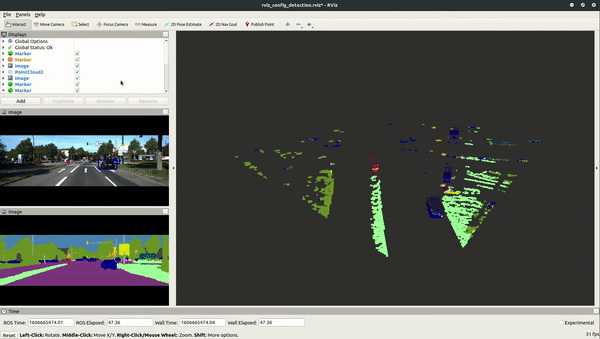

[](https://opensource.org/licenses/MIT)  

ROS package for segmentation based object detection of the KITTI dataset
==========

This repo is cloned from [SARosPerceptionKitti](https://github.com/appinho/SARosPerceptionKitti) for object detection of the KITTI dataset.

## Demo
<p align="center">
  
</p>

## Setup
Store the rosbag file with 4 digit number name of KITTI dataset as follows:

```
    ~                                        # Home directory
    └── catkin_ws                            # Catkin workspace
        └── src                              # Source folder
            └── SARosPerceptionKitti         # Repo
                ├── data                     # Dataset directory
                    └── rosbags              # ROSbag directory
                        ├── 0000.bag         # ROSbag file
                        ... 
                        └── xxxx.bag         # ROSbag file
```
or change the directory folder in all launch files `NODE_NAME/NODE_NAME.launch`.

1) Install [ROS](http://wiki.ros.org/Installation/Ubuntu) and create a [catkin workspace](http://wiki.ros.org/catkin/Tutorials/create_a_workspace) in your home directory:  

```
mkdir -p ~/catkin_ws/src
```

2) Clone this repository into the catkin workspace's source folder (src) and build it:  

```
cd ~/catkin_ws/src
git clone --recurse-submodules https://github.com/vhgnguyen/HGRosPerception.git
cd ~/catkin_ws
catkin_make
source devel/setup.bash
```

3) [Download a preprocessed scenario](https://drive.google.com/drive/folders/1vHpkoC78fPXT64-VFL1H5Mm1bdukK5Qz?usp=sharing). Unzip and store under the folder in [this instruction](#setup).

#### Note
The semantic segmentated images are already included in the rosbag files. The camera data is segmentated by pre-trained Deep Neural Network [Google's Deeplab on KITTI dataset](https://github.com/hiwad-aziz/kitti_deeplab).

## Usage
Launch ROS node to perform and visualize:

```
source devel/setup.bash
roslaunch detection detection.launch home_dir:=/home/USER_NAME scenario:=ROSBAG_NUMBER
```

* Default parameters for RViz visualization:
    * speed := 0.2          # replay with 20% of its speed
    * delay := 3            # 3 second delay

